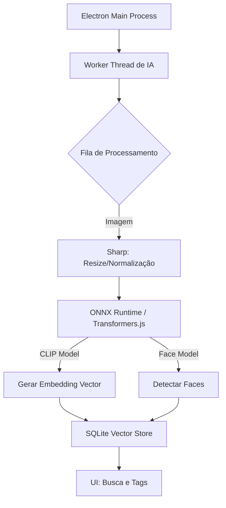

# 🧠 Arquitetura de IA Local (On-Device) - Zona21

Para implementar as funcionalidades de IA da v0.6.0 (Auto-tagging, Face Detection, Similaridade, Smart Culling) **sem custos recorrentes de API** (cloud-free) e preservando a privacidade do usuário, utilizaremos uma arquitetura **On-Device (Local)**.

## 🚀 Estratégia Tecnológica: Transformers.js + ONNX

A solução recomendada é utilizar **[Transformers.js](https://huggingface.co/docs/transformers.js)** em conjunto com **ONNX Runtime**. Isso permite rodar modelos de State-of-the-Art diretamente no Electron (Node.js) ou no navegador, usando a CPU/GPU do usuário.

### Vantagens
1.  **Custo Zero**: Nenhum custo de API por imagem processada.
2.  **Privacidade**: As fotos nunca saem do computador do usuário.
3.  **Offline**: Funciona 100% sem internet.
4.  **Performance**: Modelos quantizados (Int8) são rápidos e leves.

---

## 🛠️ Implementação por Feature

### 1. Auto-tagging & Content Analysis (Busca Semântica)
**Modelo Recomendado:** [CLIP (Contrastive Language-Image Pre-Training)](https://huggingface.co/openai/clip-vit-base-patch32) - Versão Quantizada (Xenova/clip-vit-base-patch32).

**Como funciona:**
*   O modelo CLIP entende texto e imagem no mesmo "espaço matemático".
*   Ele gera um **Vetor de Características (Embedding)** para cada imagem.
*   **Tagging**: Podemos classificar a imagem comparando-a com uma lista de 1000+ palavras-chave pré-definidas (ex: "praia", "aniversário", "gato") e pegando as de maior pontuação.
*   **Busca**: O usuário digita "cachorro na grama", geramos o vetor do texto e comparamos com os vetores das imagens.

### 2. Similaridade & Smart Culling
**Tecnologia:** Embeddings do CLIP (já gerados acima) + Algoritmo de Distância de Cosseno.

**Como funciona:**
*   **Similaridade**: Imagens visualmente parecidas terão vetores matematicamente próximos.
*   **Smart Culling**: Agrupamos fotos tiradas no mesmo segundo (burst mode). Dentro do grupo, comparamos a "qualidade técnica" (score de nitidez/foco) e a similaridade. Sugerimos a melhor baseada em heurísticas (olhos abertos, sem desfoque).

### 3. Face Detection & Recognition
**Modelo Recomendado:** [face-api.js](https://github.com/justadudewhohacks/face-api.js/) (Baseado em TensorFlow.js) ou **MediaPipe Face Detection**.

**Como funciona:**
*   Biblioteca leve e otimizada para JS.
*   **Detecção**: Localiza rostos na imagem.
*   **Reconhecimento**: Gera um vetor único para cada rosto.
*   **Clustering**: Agrupa vetores similares para identificar "Pessoa A", "Pessoa B". O usuário nomeia "Pessoa A" = "Maria", e a IA propaga para todas as outras fotos do cluster.

### 4. Smart Rename
**Lógica:** Combinação de Metadados + IA.

**Como funciona:**
*   Usa o reconhecimento de conteúdo e data.
*   Ex: `IMG_001.JPG` -> `2024-01-20_Praia_Aniversario_01.jpg` (onde "Praia" e "Aniversario" vieram do Auto-tagging).

---

## 🏗️ Arquitetura do Sistema

### Impacto no App
*   **Tamanho do App**: Adicionará ~100MB-200MB (modelos quantizados baixados sob demanda ou embarcados).
*   **Performance**: O processamento deve ocorrer em background (Worker Thread) com baixa prioridade para não travar a UI.
*   **Armazenamento**: Vetores ocupam pouco espaço. Precisaremos de uma extensão vetor para o SQLite (`sqlite-vss`) ou apenas armazenar como BLOB e computar em memória (para <100k fotos é viável).

---

## 📅 Plano de Ação (Roadmap Técnico)

1.  **POC (Proof of Concept)**: Criar um script simples Node.js que carrega o CLIP e classifica 1 imagem.
2.  **Worker de IA**: Criar um novo Worker no Electron dedicado a carregar esses modelos pesados.
3.  **Pipeline de Ingestão**: Atualizar o `indexer-worker` para enviar imagens processadas para a fila de IA.
4.  **UI**: Adicionar barra de busca semântica e aba de "Pessoas".

## 💰 Custo
*   **API Costs**: $0.00
*   **Hardware**: Usa o do usuário.
*   **Dev Time**: Médio/Alto (curva de aprendizado de ML em JS).
