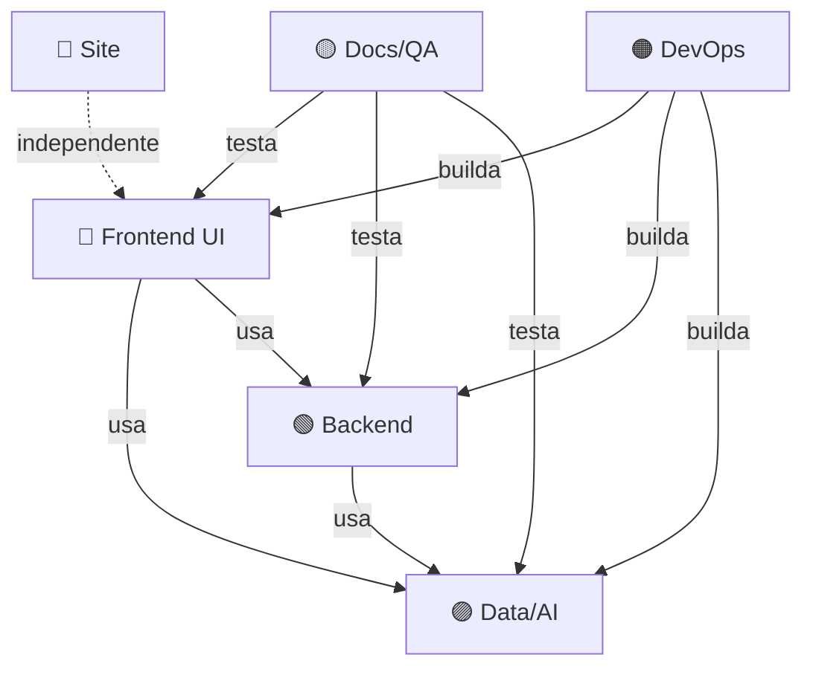

# 🤖 Sistema de Coordenação Multi-Agente

**Sistema Escalável para 4+ Agentes Trabalhando em Paralelo**

---

## 🎯 Visão Geral

Este documento define a estrutura para coordenar múltiplos agentes de IA trabalhando simultaneamente no projeto Zona21, maximizando a velocidade de desenvolvimento enquanto minimiza conflitos.

---

## 👥 Estrutura de Agentes

### Agente 1: Frontend UI/UX Lead
**Identificador:** `AGENT_FRONTEND_UI`
**Cor de Identificação:** 🔵 Azul

**Responsabilidades:**
- Componentes React em `/src/components/`
- Estilos e CSS/Tailwind
- Animações e transições (Framer Motion)
- Responsividade e acessibilidade
- UX micro-interações

**Arquivos Principais:**
```
src/components/**/*.tsx
src/components/**/*.css
src/styles/
tailwind.config.js
```

**Não Deve Tocar:**
- Backend/Electron (`/electron/`)
- Lógica de banco de dados
- APIs e serviços
- Build configs

**Log de Atividade:** `docs/agents/frontend-ui-log.md`

---

### Agente 2: Backend/Electron Lead
**Identificador:** `AGENT_BACKEND`
**Cor de Identificação:** 🟢 Verde

**Responsabilidades:**
- Código Electron em `/electron/`
- IPC (Inter-Process Communication)
- Integração com sistema operacional
- Gerenciamento de processos
- Auto-update e distribuição

**Arquivos Principais:**
```
electron/**/*.ts
src/services/ipc*.ts
electron-builder.yml
electron-builder.config.js
```

**Não Deve Tocar:**
- Componentes React UI
- Estilos visuais
- Documentação de usuário
- Website/landing page

**Log de Atividade:** `docs/agents/backend-log.md`

---

### Agente 3: Data & AI Services Lead
**Identificador:** `AGENT_DATA_AI`
**Cor de Identificação:** 🟣 Roxo

**Responsabilidades:**
- Integração com APIs de IA (Anthropic, etc.)
- Processamento de imagens e vídeos
- Banco de dados SQLite
- Serviços de mídia (FFmpeg, ExifTool, Sharp)
- Machine Learning e análise de conteúdo

**Arquivos Principais:**
```
src/services/ai*.ts
src/services/media*.ts
src/services/database*.ts
src/lib/ai/
electron/services/ai/
```

**Não Deve Tocar:**
- UI Components diretos
- Electron main process core
- Build pipelines
- Documentação de usuário

**Log de Atividade:** `docs/agents/data-ai-log.md`

---

### Agente 4: DevOps & Build Lead
**Identificador:** `AGENT_DEVOPS`
**Cor de Identificação:** 🟠 Laranja

**Responsabilidades:**
- CI/CD (.github, .gitlab-ci.yml)
- Build configurations
- Testes automatizados
- Performance e otimização
- Scripts de deploy
- Windows Store, Mac App Store

**Arquivos Principais:**
```
.github/workflows/
.gitlab-ci.yml
vite.config.ts
vitest.config*.ts
playwright.config.ts
package.json (scripts)
scripts/**/*.sh
```

**Não Deve Tocar:**
- Lógica de negócio
- Componentes React
- Electron IPC
- Serviços de IA

**Log de Atividade:** `docs/agents/devops-log.md`

---

### Agente 5: Documentation & Testing Lead
**Identificador:** `AGENT_DOCS_QA`
**Cor de Identificação:** 🟡 Amarelo

**Responsabilidades:**
- Documentação técnica e de usuário
- Testes E2E e integração
- Checklists de QA
- Roadmaps e planejamento
- Changelogs e release notes

**Arquivos Principais:**
```
docs/**/*.md
README.md
CHANGELOG.md
ROADMAP.md
e2e/**/*.spec.ts
src/**/*.test.ts
src/**/*.spec.ts
```

**Não Deve Tocar:**
- Código de produção (apenas testes)
- Configurações de build
- Componentes principais

**Log de Atividade:** `docs/agents/docs-qa-log.md`

---

### Agente 6: Site & Marketing Lead (Opcional)
**Identificador:** `AGENT_SITE`
**Cor de Identificação:** 🔴 Vermelho

**Responsabilidades:**
- Landing page (`/site/`)
- Conteúdo de marketing
- SEO e otimização web
- Assets visuais (logos, banners)
- Website beta

**Arquivos Principais:**
```
site/**/*
site-improved/**/*
docs/instalacao/
docs/*beta*.md
```

**Não Deve Tocar:**
- Aplicação Electron
- Lógica de negócio
- Build da aplicação

**Log de Atividade:** `docs/agents/site-log.md`

---

## 🔄 Protocolo de Sincronização

### Workflow de Trabalho

#### 1. Antes de Iniciar Trabalho (OBRIGATÓRIO)
```bash
# 1. Atualizar branch local
git pull origin main

# 2. Verificar status
git status

# 3. Executar script de detecção de conflitos
./scripts/detect-conflicts.sh

# 4. Consultar SUPERVISOR_LOG.md
cat docs/SUPERVISOR_LOG.md | grep "$(date +%Y-%m-%d)"

# 5. Registrar intenção no log do agente
echo "## [$(date +%Y-%m-%d\ %H:%M)] - Iniciando trabalho em [ÁREA]" >> docs/agents/[seu-log].md
```

#### 2. Durante o Trabalho
```bash
# A cada 15-30 minutos ou após mudança significativa:

# 1. Commit incremental
git add [arquivos-modificados]
git commit -m "[AGENT_ID] feat: descrição curta da mudança"

# 2. Atualizar log de atividade
# Documentar mudanças no seu arquivo de log

# 3. Verificar conflitos
./scripts/detect-conflicts.sh
```

#### 3. Após Completar Tarefa
```bash
# 1. Executar testes relevantes
npm run test # ou específico para sua área

# 2. Build (se relevante)
npm run build

# 3. Atualizar documentação
# Editar docs relevantes

# 4. Commit final
git add .
git commit -m "[AGENT_ID] feat: implementação completa de [FEATURE]

- Item 1
- Item 2
- Item 3

Co-Authored-By: Claude Sonnet 4.5 <noreply@anthropic.com>"

# 5. Push
git push origin main

# 6. Notificar supervisor
# Atualizar SUPERVISOR_LOG.md com resumo
```

---

## 🚨 Sistema de Alertas e Prioridades

### 🔴 Prioridade CRÍTICA - Bloqueia Outros Agentes
**Ação:** Notificar IMEDIATAMENTE no SUPERVISOR_LOG.md e parar trabalhos relacionados

Exemplos:
- Breaking changes em APIs internas
- Mudanças em estrutura de dados compartilhada
- Refatoração de código compartilhado
- Mudanças em IPC channels

### 🟠 Prioridade ALTA - Afeta Outros Agentes
**Ação:** Documentar no SUPERVISOR_LOG.md antes de implementar

Exemplos:
- Novos componentes compartilhados
- Mudanças em interfaces TypeScript
- Novas dependências npm
- Mudanças em fluxo de dados

### 🟡 Prioridade MÉDIA - Pode Afetar Outros Agentes
**Ação:** Documentar no log do agente e mencionar no commit

Exemplos:
- Mudanças em estilos globais
- Novos hooks ou utilities
- Mudanças em configuração

### 🟢 Prioridade BAIXA - Isolada
**Ação:** Apenas documentar no log do agente

Exemplos:
- Componentes UI isolados
- Documentação
- Testes unitários específicos

---

## 📊 Dashboard de Status em Tempo Real

### Verificação Rápida
```bash
# Ver quem está trabalhando em quê
grep "Status:" docs/agents/*-log.md

# Ver últimos commits de cada agente
git log --pretty=format:"%h|%an|%ar|%s" --since="2 hours ago" | grep AGENT

# Ver arquivos sendo modificados agora
git status -s
```

### Status dos Agentes (Atualizar a cada 30min)

| Agente | Status | Trabalhando em | ETA | Bloqueios |
|--------|--------|----------------|-----|-----------|
| 🔵 Frontend UI | 🟢 Ativo | - | - | Nenhum |
| 🟢 Backend | 🟢 Ativo | - | - | Nenhum |
| 🟣 Data/AI | 🟢 Ativo | - | - | Nenhum |
| 🟠 DevOps | 🟢 Ativo | - | - | Nenhum |
| 🟡 Docs/QA | 🟢 Ativo | - | - | Nenhum |
| 🔴 Site | 🟢 Ativo | - | - | Nenhum |

**Legenda:**
- 🟢 Ativo e trabalhando
- 🟡 Aguardando dependência
- 🔴 Bloqueado
- ⚪ Inativo

---

## 🎯 Matriz de Dependências

### Quem Depende de Quem



**Regra de Ouro:** Agentes upstream (AI, Backend) devem comunicar mudanças ANTES de implementar

---

## 🔧 Resolução de Conflitos

### Processo de 3 Passos

#### 1. Detecção Automática
```bash
./scripts/detect-conflicts.sh
```

#### 2. Análise e Categorização
- **Conflito de Git:** Resolver via merge/rebase
- **Conflito Lógico:** Dois agentes modificando mesma feature
- **Conflito de Interface:** Mudanças em APIs internas
- **Conflito de Dependência:** Race condition em implementação

#### 3. Resolução
1. **Agentes Param:** Ambos param trabalho na área em conflito
2. **Supervisor Analisa:** Determina melhor abordagem
3. **Decisão Documentada:** No SUPERVISOR_LOG.md
4. **Implementação Sequencial:** Um agente por vez na área
5. **Verificação:** Testes passam, build funciona
6. **Retomada:** Outros agentes podem continuar

---

## 📝 Templates Rápidos

### Template de Commit
```
[AGENT_ID] tipo: descrição curta

- Detalhes linha 1
- Detalhes linha 2

Impacto: [ALTO/MÉDIO/BAIXO] em [áreas afetadas]
Agentes Afetados: @AGENT_X @AGENT_Y

Co-Authored-By: Claude Sonnet 4.5 <noreply@anthropic.com>
```

### Template de Notificação
```markdown
## 🚨 NOTIFICAÇÃO PARA: @AGENT_X

**De:** @AGENT_Y
**Data:** YYYY-MM-DD HH:MM
**Prioridade:** 🔴/🟠/🟡/🟢

**Mudança:**
[Descrever mudança]

**Impacto em seu trabalho:**
[Explicar impacto]

**Ação Necessária:**
- [ ] Revisar interface X
- [ ] Atualizar código em Y
- [ ] Verificar testes
```

---

## 🏃‍♂️ Quick Start para Novos Agentes

### Onboarding em 5 Minutos

1. **Identifique seu papel:** Qual agente você é? (Frontend, Backend, etc.)
2. **Leia sua seção:** Apenas sua parte neste documento
3. **Clone seu template:** `cp docs/AGENT_ACTIVITY_TEMPLATE.md docs/agents/[seu-nome]-log.md`
4. **Execute checklist inicial:**
   ```bash
   git pull
   ./scripts/detect-conflicts.sh
   cat docs/SUPERVISOR_LOG.md
   ```
5. **Registre início:** Adicione entrada no seu log
6. **Comece a trabalhar!** 🚀

---

## 📈 Métricas de Performance

### KPIs do Sistema Multi-Agente

- **Tempo de resolução de conflitos:** < 15 minutos
- **Taxa de conflitos:** < 5% dos commits
- **Cobertura de testes:** > 80%
- **Build success rate:** > 95%
- **Commits por agente por dia:** 10-20
- **Tempo de sincronização:** < 2 minutos

---

## 🎓 Melhores Práticas

### ✅ FAZER
- ✅ Commits pequenos e frequentes
- ✅ Mensagens de commit descritivas com [AGENT_ID]
- ✅ Atualizar log de atividade em tempo real
- ✅ Executar testes antes de push
- ✅ Comunicar mudanças que afetam outros
- ✅ Pull antes de iniciar trabalho
- ✅ Respeitar áreas de responsabilidade

### ❌ NÃO FAZER
- ❌ Commits gigantes com múltiplas features
- ❌ Trabalhar em área de outro agente sem coordenar
- ❌ Push sem testar
- ❌ Ignorar conflitos detectados
- ❌ Modificar arquivos fora de sua responsabilidade
- ❌ Fazer breaking changes sem notificar
- ❌ Trabalhar offline por muito tempo

---

## 🆘 Troubleshooting

### "Outro agente está trabalhando no mesmo arquivo"
**Solução:**
1. Verificar no SUPERVISOR_LOG.md quem está trabalhando
2. Coordenar via log ou esperar conclusão
3. Se urgente, dividir arquivo em partes menores

### "Conflito de merge ao fazer push"
**Solução:**
1. `git pull --rebase`
2. Resolver conflitos localmente
3. `./scripts/detect-conflicts.sh`
4. Testar novamente
5. Push

### "Minha mudança quebrou build de outro agente"
**Solução:**
1. Reverter mudança temporariamente: `git revert HEAD`
2. Documentar problema no SUPERVISOR_LOG.md
3. Coordenar solução com agente afetado
4. Reimplementar com fixes

### "Não sei se posso modificar este arquivo"
**Solução:**
1. Verificar matriz de responsabilidades acima
2. Se em dúvida, perguntar no SUPERVISOR_LOG.md
3. Documentar decisão para referência futura

---

## 📞 Contato com Supervisor

### Quando Acionar o Supervisor

- 🚨 Conflito crítico não resolvível entre agentes
- 🚨 Breaking change necessário mas impacta múltiplos agentes
- 🚨 Decisão arquitetural importante
- 🚨 Deadlock: dois agentes dependem um do outro
- 🚨 Bug crítico que afeta múltiplas áreas
- 🚨 Necessidade de redefinir responsabilidades

### Como Acionar
```markdown
## 🆘 SUPERVISOR HELP NEEDED

**Agente:** @AGENT_X
**Data:** YYYY-MM-DD HH:MM
**Prioridade:** CRÍTICA

**Problema:**
[Descrição detalhada]

**Agentes Envolvidos:**
- @AGENT_Y: [sua perspectiva]
- @AGENT_Z: [sua perspectiva]

**Tentativas de Resolução:**
1. [O que já foi tentado]
2. [O que não funcionou]

**Proposta de Solução:**
[Se houver]

**Bloqueio Atual:**
[O que está impedindo progresso]
```

---

## 🔄 Atualizações deste Documento

Este documento evolui com o projeto. Última atualização: 2026-01-29

**Changelog:**
- 2026-01-29: Criação inicial do sistema multi-agente

---

**Lembre-se:**
- 🤝 Comunicação é chave
- 📝 Documentação em tempo real
- 🔍 Sempre verificar antes de modificar
- 🚀 Commits pequenos e frequentes
- ✅ Testes antes de push

**Sistema criado por:** Claude Sonnet 4.5 (Supervisor)
