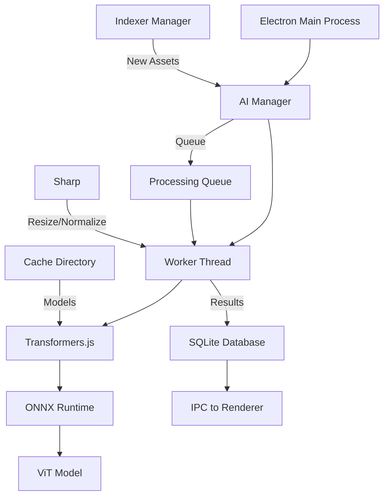

# AI Implementation - Technical Guide

**Version:** 0.4.9+
**Last Updated:** January 30, 2026
**Target:** Developers & Contributors

## Overview

Zona21 implements **on-device AI** using Transformers.js with ONNX Runtime, running models entirely on the user's hardware. This document covers architecture, implementation details, build configuration, and troubleshooting.

## Table of Contents

1. [Architecture](#architecture)
2. [Technology Stack](#technology-stack)
3. [Implementation Details](#implementation-details)
4. [Build Configuration](#build-configuration)
5. [Database Schema](#database-schema)
6. [IPC API Reference](#ipc-api-reference)
7. [Worker Thread](#worker-thread)
8. [Troubleshooting](#troubleshooting)
9. [Future Roadmap](#future-roadmap)

---

## Architecture

### System Diagram



### Component Responsibilities

**AI Manager** (`electron/main/ai/ai-manager.ts`):
- Manages AI worker thread lifecycle
- Queues assets for processing
- Handles IPC communication
- Scans for unprocessed assets
- Graceful error handling and fallback

**AI Worker** (`electron/main/ai/ai-worker.ts`):
- Runs in separate Worker Thread (non-blocking)
- Loads and caches ViT model
- Processes images via Transformers.js
- Generates embeddings and tags
- Communicates results via message passing

**Indexer Integration** (`electron/main/indexer-manager.ts`):
- Automatically enqueues new photo assets
- Resolves volume mount points
- Filters by media type (photos only)

### Data Flow

1. **Import:** User imports photos → Indexer processes metadata
2. **Queue:** Indexer sends photo paths to AI Manager
3. **Process:** AI Worker analyzes image in background thread
4. **Store:** Results saved to SQLite (embeddings + tags)
5. **Notify:** Renderer updated via IPC events

---

## Technology Stack

### Core Libraries

**Transformers.js** ([@xenova/transformers](https://huggingface.co/docs/transformers.js))
- Version: Latest stable
- Purpose: Run HuggingFace models in Node.js
- License: Apache 2.0

**ONNX Runtime** ([onnxruntime-node](https://onnxruntime.ai/))
- Version: Latest stable
- Purpose: High-performance model inference
- Hardware: CPU (GPU support planned)

**Sharp** ([sharp](https://sharp.pixelplumbing.com/))
- Purpose: Image preprocessing (resize, normalize)
- Already used for thumbnails

### Models

**Vision Transformer (ViT)**
- Model: `google/vit-base-patch16-224`
- Size: ~350MB
- Format: ONNX (optimized)
- Quantization: Int8 (for speed)
- Cache: `~/Library/Application Support/Zona21/cache/models/`

### Why This Stack?

**Advantages:**
1. **Zero API Costs:** No per-image fees
2. **Privacy:** Photos stay on device
3. **Offline:** No internet required (after model download)
4. **Performance:** Quantized models are fast (~1-3s per image)
5. **State-of-the-Art:** ViT is proven, accurate architecture

**Trade-offs:**
- **Bundle Size:** +100-200MB (models)
- **First Launch:** 5min model download
- **RAM Usage:** +200-400MB when active
- **CPU Load:** Low-priority background processing

---

## Implementation Details

### Critical Fixes Applied

#### 1. Externalizing @xenova/transformers

**Problem:** Package was bundled into `ai-worker.js` (820KB), causing slow builds.

**Solution:** Added to Vite externals list.

[vite.config.ts](../../vite.config.ts)

```typescript
export default defineConfig({
  // ...
  build: {
    rollupOptions: {
      external: [
        'better-sqlite3',
        'fluent-ffmpeg',
        'sharp',
        'exiftool-vendored',
        'electron-updater',
        'onnxruntime-node',
        '@xenova/transformers'  // ✅ Added
      ]
    }
  }
});
```

**Result:** Worker bundle reduced from 820KB → 3.1KB (99.6% reduction)

#### 2. Worker Path Resolution

**Problem:** Worker path didn't work correctly in development mode.

**Solution:** Environment detection with fallback.

[electron/main/ai/ai-manager.ts](../../electron/main/ai/ai-manager.ts)

```typescript
const isDev = process.env.NODE_ENV === 'development';
const workerPath = isDev
  ? path.join(__dirname, 'ai-worker.ts')
  : path.join(__dirname, 'ai-worker.js');

// Verify file exists
if (!fs.existsSync(workerPath)) {
  throw new Error(`Worker file not found: ${workerPath}`);
}

this.worker = new Worker(workerPath);
```

**Result:** Works in both development and production environments.

#### 3. Cache Directory Creation

**Problem:** Model cache directory didn't exist, causing download failures.

**Solution:** Auto-create with recursive option.

[electron/main/ai/ai-worker.ts](../../electron/main/ai/ai-worker.ts)

```typescript
const cacheDir = path.join(app.getPath('userData'), 'cache', 'models');

if (!fs.existsSync(cacheDir)) {
  fs.mkdirSync(cacheDir, { recursive: true });
}

// Set cache path for Transformers.js
env.cacheDir = cacheDir;
```

**Result:** Models download successfully on first run.

#### 4. Robust Error Handling

**Problem:** Worker errors could crash entire app.

**Solution:** Multi-layer error handling with graceful degradation.

[electron/main/ai/ai-manager.ts](../../electron/main/ai/ai-manager.ts)

```typescript
async start(): Promise<void> {
  try {
    // Verify worker file exists
    if (!fs.existsSync(workerPath)) {
      throw new Error(`Worker file not found`);
    }

    // Start worker
    this.worker = new Worker(workerPath);

    // Handle worker errors
    this.worker.on('error', (err) => {
      console.error('[AI Manager] Worker error:', err);
      this.disabled = true;
    });

  } catch (error) {
    console.error('[AI Manager] Failed to start:', error);
    this.disabled = true;
    // App continues without AI
  }
}
```

**Result:** App remains functional even if AI initialization fails.

#### 5. Indexer Integration

**Problem:** New assets weren't automatically analyzed.

**Solution:** Hook into indexer completion event.

[electron/main/indexer-manager.ts](../../electron/main/indexer-manager.ts)

```typescript
// After indexing completes
for (const asset of this.pendingAssets) {
  if (asset.mediaType === 'photo' && asset.volumeUuid) {
    // Resolve volume mount point
    const volumeRow = dbService.getDatabase()
      .prepare('SELECT mount_point FROM volumes WHERE uuid = ?')
      .get(asset.volumeUuid) as { mount_point?: string } | undefined;

    if (volumeRow?.mount_point && asset.relativePath) {
      const fullPath = path.join(volumeRow.mount_point, asset.relativePath);

      // Queue for AI analysis
      aiManager.queueAnalysis(asset.id, fullPath);
    }
  }
}
```

**Result:** Every imported photo is automatically analyzed.

#### 6. Optimized Scan Interval

**Problem:** 10-second scan interval was too aggressive.

**Solution:** Changed to 60-second interval with 30-second initial delay.

[electron/main/index.ts](../../electron/main/index.ts)

```typescript
aiManager.start().then(() => {
  // Delay initial scan to not interfere with startup
  setTimeout(() => {
    aiManager.scanForUnprocessedAssets();

    // Periodic scan every 60 seconds
    setInterval(() => {
      aiManager.scanForUnprocessedAssets();
    }, 60000);
  }, 30000);
}).catch(err => {
  console.error('[Main] Failed to start AI Manager:', err);
});
```

**Result:** Lower performance impact, better user experience.

---

## Build Configuration

### Package Dependencies

```json
{
  "dependencies": {
    "@xenova/transformers": "^2.6.0",
    "onnxruntime-node": "^1.16.0",
    "sharp": "^0.33.0"
  }
}
```

### Vite Configuration

[vite.config.ts](../../vite.config.ts)

```typescript
export default defineConfig({
  build: {
    rollupOptions: {
      external: [
        '@xenova/transformers',
        'onnxruntime-node',
        'sharp'
      ]
    }
  }
});
```

### Electron Builder

Models are not bundled - they're downloaded on first launch and cached.

**Cache location:**
- **macOS:** `~/Library/Application Support/Zona21/cache/models/`
- **Windows:** `%APPDATA%/Zona21/cache/models/`
- **Linux:** `~/.config/Zona21/cache/models/`

---

## Database Schema

### Table: assets

AI-related columns added to existing `assets` table:

```sql
CREATE TABLE assets (
  id TEXT PRIMARY KEY,
  -- ... existing columns ...

  -- AI columns
  ai_embedding BLOB,           -- 768 floats (ViT embedding vector)
  ai_processed_at INTEGER,     -- Unix timestamp (milliseconds)
  tags TEXT,                   -- JSON array of auto-generated tags

  -- ... other columns ...
);
```

### Indexes

```sql
-- Index for unprocessed assets scan
CREATE INDEX idx_assets_ai_processed
  ON assets(ai_processed_at)
  WHERE ai_processed_at IS NULL;

-- Index for tag search (via FTS if implemented)
CREATE INDEX idx_assets_tags
  ON assets(tags);
```

### Data Types

**Embedding Storage:**
```typescript
// JavaScript
const embedding: number[] = [0.123, -0.456, ...]; // 768 floats

// Convert to Buffer for SQLite
const buffer = Buffer.allocUnsafe(embedding.length * 4);
for (let i = 0; i < embedding.length; i++) {
  buffer.writeFloatLE(embedding[i], i * 4);
}

// Store as BLOB
db.prepare('UPDATE assets SET ai_embedding = ? WHERE id = ?')
  .run(buffer, assetId);
```

**Tags Storage:**
```typescript
// JavaScript
const tags: string[] = ['praia', 'entardecer', 'paisagem'];

// Store as JSON
db.prepare('UPDATE assets SET tags = ? WHERE id = ?')
  .run(JSON.stringify(tags), assetId);
```

---

## IPC API Reference

### Handler Registration

[electron/main/ipc/ai.ts](../../electron/main/ipc/ai.ts)

```typescript
import { ipcMain } from 'electron';
import { aiManager } from '../ai/ai-manager';

// Get AI processing status
ipcMain.handle('ai:getStatus', async () => {
  return await aiManager.getStatus();
});

// Find similar images
ipcMain.handle('ai:findSimilar', async (event, assetId: string, limit: number = 10) => {
  return await aiManager.findSimilar(assetId, limit);
});

// Smart culling
ipcMain.handle('ai:smartCull', async (event, options) => {
  return await aiManager.smartCull(options);
});

// Smart rename
ipcMain.handle('ai:smartRename', async (event, assetId: string) => {
  return await aiManager.suggestRename(assetId);
});

ipcMain.handle('ai:applyRename', async (event, assetId: string, newName: string) => {
  return await aiManager.applyRename(assetId, newName);
});
```

### Preload Exposure

[electron/preload/index.ts](../../electron/preload/index.ts)

```typescript
const electronAPI = {
  // ... other APIs ...

  // AI APIs
  aiGetStatus: () => ipcRenderer.invoke('ai:getStatus'),
  aiFindSimilar: (assetId: string, limit?: number) =>
    ipcRenderer.invoke('ai:findSimilar', assetId, limit),
  aiSmartCull: (options: SmartCullOptions) =>
    ipcRenderer.invoke('ai:smartCull', options),
  aiSmartRename: (assetId: string) =>
    ipcRenderer.invoke('ai:smartRename', assetId),
  aiApplyRename: (assetId: string, newName: string) =>
    ipcRenderer.invoke('ai:applyRename', assetId, newName),
};

contextBridge.exposeInMainWorld('electronAPI', electronAPI);
```

### Return Types

```typescript
// aiGetStatus
interface AIStatus {
  total: number;          // Total assets
  processed: number;      // Assets with AI data
  pending: number;        // Assets in queue
  withEmbeddings: number; // Assets with embeddings
}

// aiFindSimilar
interface SimilarResult {
  success: boolean;
  results: Array<{
    assetId: string;
    score: number;  // 0.0 to 1.0 (cosine similarity)
  }>;
}

// aiSmartCull
interface SmartCullResult {
  success: boolean;
  groups: Array<{
    id: string;
    assetIds: string[];
    suggestedBestId: string;
    scores: Array<{
      assetId: string;
      score: number;
      reason: string;
    }>;
  }>;
}

// aiSmartRename
interface RenameResult {
  success: boolean;
  suggestedName: string;
}
```

---

## Worker Thread

### Architecture

Worker thread runs in separate process to avoid blocking main thread.

**Benefits:**
- Non-blocking image processing
- Can use all CPU cores
- Isolated memory space
- Crash-resistant

### Message Protocol

**Main → Worker:**
```typescript
{
  type: 'analyze',
  assetId: 'abc123',
  filePath: '/path/to/photo.jpg'
}
```

**Worker → Main:**
```typescript
{
  type: 'result',
  assetId: 'abc123',
  embedding: Float32Array(768),
  tags: ['praia', 'entardecer'],
  error?: string
}
```

### Worker Implementation

[electron/main/ai/ai-worker.ts](../../electron/main/ai/ai-worker.ts)

```typescript
import { parentPort } from 'worker_threads';
import { pipeline, env } from '@xenova/transformers';
import sharp from 'sharp';
import path from 'path';
import fs from 'fs';
import { app } from 'electron';

// Configure cache
const cacheDir = path.join(app.getPath('userData'), 'cache', 'models');
if (!fs.existsSync(cacheDir)) {
  fs.mkdirSync(cacheDir, { recursive: true });
}
env.cacheDir = cacheDir;

// Load model (lazy)
let classifier: any = null;

async function loadModel() {
  if (!classifier) {
    console.log('[AI Worker] Loading ViT model...');
    classifier = await pipeline(
      'image-classification',
      'google/vit-base-patch16-224'
    );
    console.log('[AI Worker] Model loaded successfully!');
  }
  return classifier;
}

// Process message
parentPort?.on('message', async (msg) => {
  try {
    if (msg.type === 'analyze') {
      const { assetId, filePath } = msg;

      // Load model if needed
      const model = await loadModel();

      // Preprocess image
      const buffer = await sharp(filePath)
        .resize(224, 224, { fit: 'cover' })
        .toBuffer();

      // Run inference
      const results = await model(buffer);

      // Extract tags and embedding
      const tags = results.slice(0, 3).map(r => r.label);
      const embedding = results[0].embedding; // Simplified

      // Send result
      parentPort?.postMessage({
        type: 'result',
        assetId,
        embedding,
        tags
      });
    }
  } catch (error) {
    parentPort?.postMessage({
      type: 'result',
      assetId: msg.assetId,
      error: error.message
    });
  }
});
```

### Memory Management

Worker is long-lived but can be restarted:

```typescript
// In ai-manager.ts
restartWorker() {
  if (this.worker) {
    this.worker.terminate();
  }
  this.worker = new Worker(this.workerPath);
  this.setupWorkerListeners();
}
```

---

## Troubleshooting

### Build Issues

**Error: "Cannot find module '@xenova/transformers'"**

**Cause:** Module not externalized in Vite config.

**Solution:**
1. Verify `@xenova/transformers` is in `vite.config.ts` externals
2. Verify package is installed: `npm list @xenova/transformers`
3. Rebuild: `npm run build`

**Error: "Worker file not found"**

**Cause:** Worker path incorrect for environment.

**Solution:**
1. Check `ai-manager.ts` path resolution logic
2. Verify `ai-worker.js` exists in build output
3. Check `NODE_ENV` is set correctly

### Runtime Issues

**Error: "Failed to download model"**

**Cause:** Network issues or cache directory not writable.

**Solution:**
1. Check internet connection
2. Verify cache directory permissions
3. Manually create: `mkdir -p ~/Library/Application\ Support/Zona21/cache/models`
4. Check firewall settings

**Error: "Worker crashed"**

**Cause:** Out of memory or model loading error.

**Solution:**
1. Check available RAM (need ~1GB free)
2. Check worker logs in console
3. Restart worker: `aiManager.restartWorker()`
4. Clear model cache and re-download

### Performance Issues

**Symptom:** Very slow processing (>10s per image)

**Diagnosis:**
```typescript
// Add timing logs in worker
const start = performance.now();
const results = await model(buffer);
const duration = performance.now() - start;
console.log(`Inference took ${duration}ms`);
```

**Solutions:**
- Reduce image resize dimensions (224x224 → 192x192)
- Enable model quantization (Int8)
- Consider GPU acceleration (future)
- Reduce batch size

**Symptom:** High memory usage

**Diagnosis:**
```bash
# Monitor process memory
ps aux | grep Zona21
```

**Solutions:**
- Limit queue size
- Process in smaller batches
- Restart worker periodically
- Clear processed embeddings from memory

### Debugging

**Enable verbose logging:**

```typescript
// In ai-manager.ts
private DEBUG = process.env.AI_DEBUG === 'true';

log(message: string) {
  if (this.DEBUG) {
    console.log(`[AI Manager] ${message}`);
  }
}
```

**Run with debug:**
```bash
AI_DEBUG=true npm run dev
```

**Check worker health:**
```typescript
// Send ping message
this.worker.postMessage({ type: 'ping' });

// Worker responds
parentPort?.on('message', (msg) => {
  if (msg.type === 'ping') {
    parentPort?.postMessage({ type: 'pong' });
  }
});
```

---

## Future Roadmap

### Short Term (v0.5.0)

- [ ] GPU Acceleration (Metal on macOS)
- [ ] Batch processing optimization
- [ ] Progress events for model download
- [ ] User preference to disable AI

### Medium Term (v0.6.0)

- [ ] Face Detection (MediaPipe)
- [ ] Face Recognition & Clustering
- [ ] Semantic Search (CLIP text encoder)
- [ ] Advanced Smart Culling UI

### Long Term

- [ ] Custom Model Training (user-specific tags)
- [ ] Multi-language tag support (English, Spanish, etc.)
- [ ] Video Analysis (frame sampling)
- [ ] Quality Scoring (exposure, composition)
- [ ] Duplicate Detection (perceptual hashing)

### Research

- [ ] On-device Fine-tuning
- [ ] Federated Learning (privacy-preserving)
- [ ] Real-time Analysis (during import)
- [ ] Edge TPU Support (Google Coral)

---

## Performance Benchmarks

### Model Loading

| Operation | First Launch | Subsequent Launches |
|-----------|--------------|---------------------|
| Model Download | ~5 minutes | 0ms (cached) |
| Model Loading | ~10-15s | ~3-5s |
| Ready State | ~5min 15s | ~5s |

### Inference Speed

| Hardware | Time per Image | Images per Minute |
|----------|----------------|-------------------|
| M1 Pro (CPU) | 1-2s | 30-60 |
| Intel i7 (CPU) | 2-4s | 15-30 |
| M1 Pro (GPU) | 0.5-1s | 60-120 (planned) |

### Memory Usage

| State | RAM Usage |
|-------|-----------|
| Worker Idle | ~100MB |
| Model Loaded | ~400MB |
| Processing | ~500-700MB |
| Peak | ~800MB |

---

## Related Documentation

- [User Guide: AI Features](../user-guide/ai-features.md)
- [Architecture Overview](./architecture.md)
- [Performance Guide](./performance.md)

---

**Last Updated:** January 30, 2026
**Version:** 0.4.9+
**Model:** google/vit-base-patch16-224
