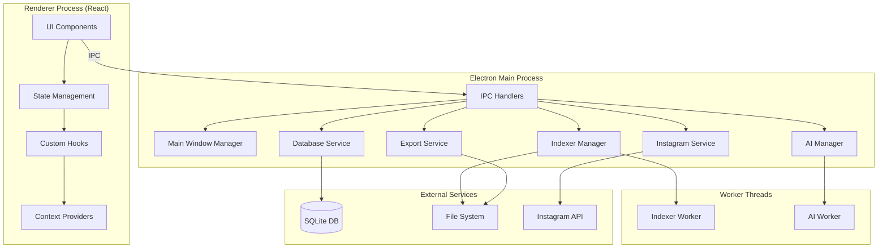
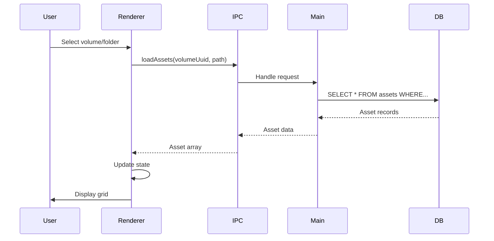
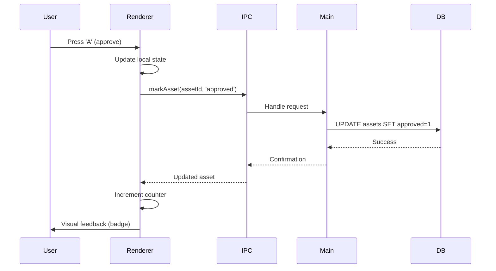
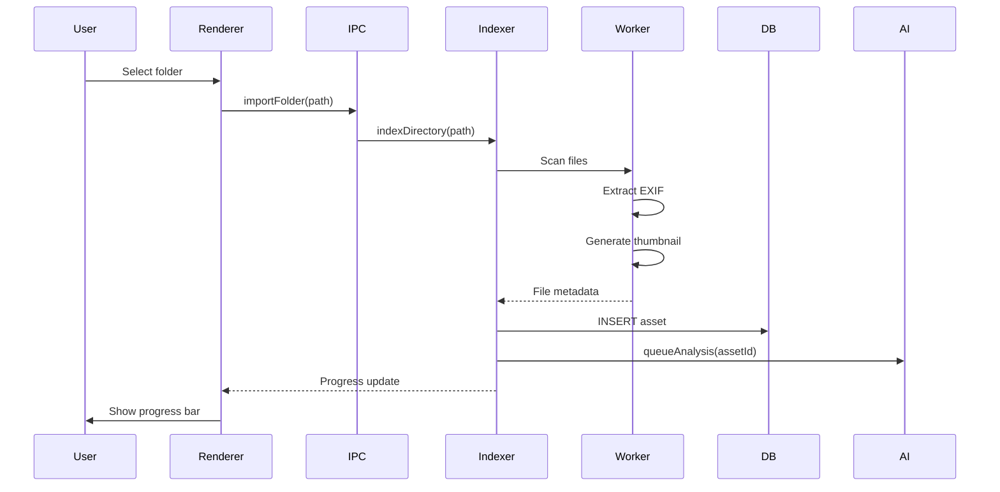

# Architecture Overview - Zona21

**Version:** 0.4.9
**Last Updated:** January 30, 2026
**Target:** Developers & Contributors

## Overview

Zona21 is an Electron-based desktop application built with React and TypeScript. This document provides a comprehensive overview of the system architecture, component responsibilities, data flow, and design decisions.

## Table of Contents

1. [High-Level Architecture](#high-level-architecture)
2. [Technology Stack](#technology-stack)
3. [Project Structure](#project-structure)
4. [Core Components](#core-components)
5. [Data Flow](#data-flow)
6. [IPC Communication](#ipc-communication)
7. [State Management](#state-management)
8. [Database Schema](#database-schema)
9. [Worker Threads](#worker-threads)
10. [Design Patterns](#design-patterns)
11. [Security Architecture](#security-architecture)

---

## High-Level Architecture

### System Diagram



### Process Model

**Main Process:**
- Manages application lifecycle
- Handles native OS integration
- Performs heavy I/O operations
- Manages worker threads
- Database operations

**Renderer Process:**
- React UI rendering
- User interactions
- State management
- IPC communication with main

**Worker Threads:**
- **Indexer Worker:** File scanning, metadata extraction
- **AI Worker:** Image analysis, ML inference

---

## Technology Stack

### Frontend

| Technology | Version | Purpose |
|------------|---------|---------|
| **React** | 18.x | UI framework |
| **TypeScript** | 5.x | Type safety |
| **Vite** | 5.x | Build tool & dev server |
| **Tailwind CSS** | 3.x | Styling framework |
| **React Window** | 1.8.x | Virtual scrolling |
| **Lucide React** | Latest | Icon library |

### Backend (Electron Main)

| Technology | Version | Purpose |
|------------|---------|---------|
| **Electron** | 33.x | Desktop framework |
| **Node.js** | 20.x | Runtime |
| **better-sqlite3** | 11.x | SQLite database |
| **Sharp** | 0.33.x | Image processing |
| **ExifTool** | Latest | Metadata extraction |
| **FFmpeg** | Latest | Video processing |

### AI/ML

| Technology | Version | Purpose |
|------------|---------|---------|
| **Transformers.js** | 2.6.x | ML inference |
| **ONNX Runtime** | 1.16.x | Model execution |
| **ViT Model** | google/vit-base-patch16-224 | Image classification |

### Development

| Technology | Purpose |
|------------|---------|
| **ESLint** | Code linting |
| **Prettier** | Code formatting |
| **TypeScript Compiler** | Type checking |
| **electron-builder** | App packaging |

---

## Project Structure

```
zona21/
├── electron/                    # Electron main process
│   ├── main/
│   │   ├── index.ts            # Main entry point
│   │   ├── window-manager.ts   # Window creation/management
│   │   ├── config-loader.ts    # Configuration management
│   │   ├── binary-paths.ts     # External binary paths
│   │   │
│   │   ├── db/                 # Database layer
│   │   │   ├── db-service.ts   # Database singleton
│   │   │   └── migrations.ts   # Schema migrations
│   │   │
│   │   ├── indexer/            # File indexing
│   │   │   ├── indexer-manager.ts
│   │   │   └── indexer-worker.ts
│   │   │
│   │   ├── ai/                 # AI features
│   │   │   ├── ai-manager.ts
│   │   │   └── ai-worker.ts
│   │   │
│   │   ├── ipc/                # IPC handlers
│   │   │   ├── assets.ts       # Asset operations
│   │   │   ├── collections.ts  # Collection management
│   │   │   ├── export.ts       # Export operations
│   │   │   ├── ai.ts           # AI operations
│   │   │   └── instagram.ts    # Instagram integration
│   │   │
│   │   └── instagram/          # Instagram service
│   │       ├── instagram-queue.ts
│   │       └── instagram-publisher.ts
│   │
│   └── preload/
│       └── index.ts            # Preload script (context bridge)
│
├── src/                        # React frontend
│   ├── App.tsx                 # Root component
│   │
│   ├── components/             # UI components
│   │   ├── Toolbar.tsx
│   │   ├── Sidebar.tsx
│   │   ├── TabBar.tsx
│   │   ├── Viewer.tsx
│   │   ├── CompareMode.tsx
│   │   ├── ContextualMenu.tsx
│   │   ├── MenuSection.tsx
│   │   └── tabs/               # Tab components
│   │       ├── ViewerTab.tsx
│   │       ├── CompareTab.tsx
│   │       ├── BatchEditTab.tsx
│   │       └── InstagramTab.tsx
│   │
│   ├── contexts/               # React contexts
│   │   ├── TabsContext.tsx     # Tab state management
│   │   └── MenuContext.tsx     # Menu state management
│   │
│   ├── hooks/                  # Custom React hooks
│   │   ├── useCelebration.ts
│   │   ├── useUnsavedChanges.ts
│   │   └── useProductivityStats.ts
│   │
│   ├── services/               # Frontend services
│   │   ├── celebration-service.ts
│   │   └── suggestion-service.ts
│   │
│   ├── utils/                  # Utility functions
│   │   └── responsive.ts
│   │
│   └── types/                  # TypeScript types
│       └── index.d.ts
│
├── docs/                       # Documentation
├── release/                    # Build output
└── package.json               # Dependencies
```

---

## Core Components

### Main Process Components

#### 1. Window Manager
**File:** `electron/main/window-manager.ts`

**Responsibilities:**
- Create and manage BrowserWindow
- Handle window lifecycle events
- Configure window properties
- Manage dev tools

**Key APIs:**
```typescript
createMainWindow(): BrowserWindow
closeAllWindows(): void
```

#### 2. Database Service
**File:** `electron/main/db/db-service.ts`

**Responsibilities:**
- SQLite database connection
- Query execution
- Transaction management
- Schema migrations

**Singleton Pattern:**
```typescript
class DatabaseService {
  private static instance: DatabaseService;
  private db: Database;

  static getInstance(): DatabaseService {
    if (!DatabaseService.instance) {
      DatabaseService.instance = new DatabaseService();
    }
    return DatabaseService.instance;
  }

  getDatabase(): Database {
    return this.db;
  }
}
```

#### 3. Indexer Manager
**File:** `electron/main/indexer/indexer-manager.ts`

**Responsibilities:**
- Scan directories for media files
- Extract metadata (EXIF)
- Generate thumbnails
- Store assets in database
- Queue new assets for AI analysis

**Architecture:**
```typescript
class IndexerManager {
  private worker: Worker;
  private queue: IndexJob[];

  async indexDirectory(path: string): Promise<void>
  private processFile(path: string): Promise<Asset>
  private generateThumbnail(path: string): Promise<string>
}
```

**Flow:**
1. User selects folder
2. IndexerManager scans recursively
3. Each file sent to IndexerWorker
4. Worker extracts metadata
5. Thumbnail generated with Sharp
6. Asset stored in SQLite
7. New photo queued for AI

#### 4. AI Manager
**File:** `electron/main/ai/ai-manager.ts`

**Responsibilities:**
- Manage AI worker lifecycle
- Queue images for analysis
- Store AI results (embeddings, tags)
- Provide similarity search
- Smart culling suggestions

**Architecture:**
```typescript
class AIManager {
  private worker: Worker;
  private queue: string[];

  queueAnalysis(assetId: string, path: string): void
  async findSimilar(assetId: string, limit: number): Promise<SimilarResult[]>
  async smartCull(options: SmartCullOptions): Promise<CullResult>
}
```

**See:** [AI Implementation Guide](./ai-implementation.md)

#### 5. Export Service
**File:** `electron/main/ipc/export.ts`

**Responsibilities:**
- Export assets to disk
- Format conversion (JPEG, PNG, TIFF)
- Resize and optimize
- Preserve or strip metadata
- Progress reporting

**Flow:**
1. User selects assets and settings
2. Export job created
3. For each asset:
   - Load original file
   - Apply transformations (Sharp)
   - Write to destination
   - Update progress
4. Complete notification

#### 6. Instagram Service
**File:** `electron/main/instagram/`

**Responsibilities:**
- OAuth authentication
- Schedule posts
- Queue management
- Publish to Instagram Graph API
- Token refresh

**See:** [Instagram Integration](../integrations/instagram.md)

### Renderer Components

#### 1. App Component
**File:** `src/App.tsx`

**Responsibilities:**
- Root component (2,172 lines - refactor planned)
- Global state management
- Tab lifecycle
- Asset loading and filtering
- IPC communication
- Event handling

**Key State:**
```typescript
const [assets, setAssets] = useState<(Asset | null)[]>([]);
const [selectedAssetIds, setSelectedAssetIds] = useState<Set<string>>(new Set());
const [volumes, setVolumes] = useState<Volume[]>([]);
const [collections, setCollections] = useState<Collection[]>([]);
```

**Refactoring Plan (v0.5.0):**
- Split into smaller components
- Extract state to contexts
- Reduce to <500 lines per component

#### 2. Tab System
**Files:** `src/components/TabBar.tsx`, `src/components/TabRenderer.tsx`

**Responsibilities:**
- VSCode-style tab management
- Tab persistence
- Unsaved changes detection
- Keyboard navigation (Cmd+1-9)

**Tab Types:**
- `home`: Main grid view
- `viewer`: Single asset viewer
- `compare`: Side-by-side comparison
- `batch-edit`: Batch editing operations
- `instagram`: Instagram scheduler

#### 3. Contextual Menu System
**Files:** `src/components/ContextualMenu.tsx`, `src/contexts/MenuContext.tsx`

**Responsibilities:**
- Figma-style collapsible side panels
- Per-tab menu content
- Persistent state (localStorage)
- Responsive behavior (mobile)

**See:** [Design System](../project-management/design-system.md)

---

## Data Flow

### Asset Loading Flow



### Marking Flow



### Import Flow



---

## IPC Communication

### Architecture

**Context Bridge (Preload):**
```typescript
// electron/preload/index.ts
const electronAPI = {
  loadAssets: (volumeUuid?: string, pathPrefix?: string) =>
    ipcRenderer.invoke('assets:load', volumeUuid, pathPrefix),

  markAsset: (assetId: string, mark: string) =>
    ipcRenderer.invoke('assets:mark', assetId, mark),

  exportAssets: (assetIds: string[], options: ExportOptions) =>
    ipcRenderer.invoke('export:start', assetIds, options),

  // ... more APIs
};

contextBridge.exposeInMainWorld('electronAPI', electronAPI);
```

### Handler Registration

```typescript
// electron/main/ipc/assets.ts
import { ipcMain } from 'electron';

ipcMain.handle('assets:load', async (event, volumeUuid, pathPrefix) => {
  const db = dbService.getDatabase();
  const query = /* SQL query */;
  const assets = db.prepare(query).all(volumeUuid, pathPrefix);
  return assets;
});

ipcMain.handle('assets:mark', async (event, assetId, mark) => {
  const db = dbService.getDatabase();
  db.prepare('UPDATE assets SET approved = ? WHERE id = ?')
    .run(mark === 'approved' ? 1 : 0, assetId);

  // Return updated asset
  return db.prepare('SELECT * FROM assets WHERE id = ?').get(assetId);
});
```

### API Categories

**Assets:**
- `assets:load` - Load assets by volume/path
- `assets:mark` - Mark asset (approved/favorite/rejected)
- `assets:update` - Update asset metadata
- `assets:delete` - Delete assets

**Collections:**
- `collections:list` - List all collections
- `collections:create` - Create new collection
- `collections:add` - Add assets to collection
- `collections:remove` - Remove assets from collection

**Export:**
- `export:start` - Start export job
- `export:progress` - Progress updates (event)
- `export:complete` - Export complete (event)

**AI:**
- `ai:getStatus` - Get processing status
- `ai:findSimilar` - Find similar images
- `ai:smartCull` - Smart culling suggestions
- `ai:smartRename` - Generate smart filename

**Instagram:**
- `instagram:auth` - OAuth authentication
- `instagram:schedule` - Schedule post
- `instagram:queue` - Get scheduled posts
- `instagram:publish` - Publish post now

**See:** [API Reference](./api-reference.md) (to be created)

---

## State Management

### Global State (App.tsx)

**Asset State:**
```typescript
const [assets, setAssets] = useState<(Asset | null)[]>([]);
const [assetsVersion, setAssetsVersion] = useState(0); // Increment to trigger refresh
const assetsRef = useRef<(Asset | null)[]>([]); // For hot paths
```

**Selection State:**
```typescript
const [selectedAssetIds, setSelectedAssetIds] = useState<Set<string>>(new Set());
const [lastSelectedIndex, setLastSelectedIndex] = useState<number | null>(null);
```

**Filter State:**
```typescript
const [currentVolume, setCurrentVolume] = useState<Volume | null>(null);
const [currentPath, setCurrentPath] = useState<string>('');
const [filterState, setFilterState] = useState<FilterState>({ /* ... */ });
```

### Context Providers

**TabsContext:**
```typescript
interface TabsContextType {
  tabs: Tab[];
  activeTabId: string | null;
  addTab: (tab: Tab) => void;
  closeTab: (tabId: string) => void;
  setActiveTab: (tabId: string) => void;
}
```

**MenuContext:**
```typescript
interface MenuContextType {
  menuStates: Record<string, MenuState>;
  toggleMenu: (tabType: string, side: 'left' | 'right') => void;
  setMenuWidth: (tabType: string, side: 'left' | 'right', width: number) => void;
}
```

### Local Storage Persistence

**Persisted State:**
- Tab list and active tab
- Menu collapse/expand state
- Menu widths
- Productivity stats
- Onboarding progress
- User preferences

**Keys:**
```typescript
'zona21:tabs' // Tab persistence
'zona21:menu-state:home:left' // Menu state
'zona21:stats' // Productivity stats
'zona21:onboarding' // Onboarding progress
```

---

## Database Schema

### Core Tables

**assets**
```sql
CREATE TABLE assets (
  id TEXT PRIMARY KEY,
  volume_uuid TEXT NOT NULL,
  relative_path TEXT NOT NULL,
  fileName TEXT NOT NULL,
  fileSize INTEGER,
  media_type TEXT, -- 'photo' | 'video'
  created_at INTEGER,
  modified_at INTEGER,
  indexed_at INTEGER,

  -- Marks
  approved INTEGER DEFAULT 0,
  flagged INTEGER DEFAULT 0,
  rejected INTEGER DEFAULT 0,

  -- Metadata
  width INTEGER,
  height INTEGER,
  duration REAL, -- for videos
  exif_data TEXT, -- JSON

  -- AI
  ai_embedding BLOB,
  ai_processed_at INTEGER,
  tags TEXT, -- JSON array

  FOREIGN KEY (volume_uuid) REFERENCES volumes(uuid)
);
```

**volumes**
```sql
CREATE TABLE volumes (
  uuid TEXT PRIMARY KEY,
  mount_point TEXT NOT NULL UNIQUE,
  name TEXT,
  indexed_at INTEGER,
  asset_count INTEGER DEFAULT 0
);
```

**collections**
```sql
CREATE TABLE collections (
  id TEXT PRIMARY KEY,
  name TEXT NOT NULL,
  created_at INTEGER,
  updated_at INTEGER
);
```

**collection_assets**
```sql
CREATE TABLE collection_assets (
  collection_id TEXT,
  asset_id TEXT,
  added_at INTEGER,
  PRIMARY KEY (collection_id, asset_id),
  FOREIGN KEY (collection_id) REFERENCES collections(id),
  FOREIGN KEY (asset_id) REFERENCES assets(id)
);
```

**oauth_tokens**
```sql
CREATE TABLE oauth_tokens (
  provider TEXT PRIMARY KEY, -- 'instagram'
  access_token TEXT NOT NULL,
  refresh_token TEXT,
  expires_at INTEGER,
  scopes TEXT,
  user_id TEXT,
  username TEXT
);
```

### Indexes

```sql
-- Performance-critical indexes
CREATE INDEX idx_assets_volume_path ON assets(volume_uuid, relative_path);
CREATE INDEX idx_assets_media_type ON assets(media_type);
CREATE INDEX idx_assets_approved ON assets(approved) WHERE approved = 1;
CREATE INDEX idx_assets_flagged ON assets(flagged) WHERE flagged = 1;
CREATE INDEX idx_assets_ai_processed ON assets(ai_processed_at) WHERE ai_processed_at IS NULL;

-- FTS for search
CREATE VIRTUAL TABLE assets_fts USING fts5(fileName, tags);
```

---

## Worker Threads

### Indexer Worker

**Purpose:** Offload file scanning to prevent main thread blocking

**Communication:**
```typescript
// Main -> Worker
{ type: 'scan', directory: '/path/to/photos' }

// Worker -> Main
{ type: 'file', path: '/path/to/photo.jpg', metadata: {...} }
{ type: 'progress', current: 50, total: 100 }
{ type: 'complete', fileCount: 100 }
```

**Process:**
1. Receive scan request
2. Recursively walk directory
3. For each file:
   - Check if supported format
   - Extract EXIF with ExifTool
   - Send file info to main
4. Report completion

### AI Worker

**Purpose:** Run ML inference without blocking

**Communication:**
```typescript
// Main -> Worker
{ type: 'analyze', assetId: 'abc123', filePath: '/path/to/photo.jpg' }

// Worker -> Main
{
  type: 'result',
  assetId: 'abc123',
  embedding: Float32Array(768),
  tags: ['praia', 'entardecer', 'paisagem'],
  error?: string
}
```

**Process:**
1. Load ViT model (lazy, cached)
2. Receive analyze request
3. Preprocess image (Sharp resize to 224x224)
4. Run inference
5. Extract embedding + top tags
6. Send results to main

**See:** [AI Implementation](./ai-implementation.md)

---

## Design Patterns

### Singleton Pattern

**DatabaseService:**
```typescript
class DatabaseService {
  private static instance: DatabaseService;

  static getInstance(): DatabaseService {
    if (!DatabaseService.instance) {
      DatabaseService.instance = new DatabaseService();
    }
    return DatabaseService.instance;
  }
}
```

**Usage:** Ensures single database connection across app

### Observer Pattern

**IPC Events:**
```typescript
// Main process (publisher)
mainWindow.webContents.send('export:progress', { current: 50, total: 100 });

// Renderer process (subscriber)
window.electronAPI.on('export:progress', (progress) => {
  updateProgressBar(progress);
});
```

### Strategy Pattern

**Export Formats:**
```typescript
interface ExportStrategy {
  export(asset: Asset, destination: string, options: ExportOptions): Promise<void>;
}

class JPEGExportStrategy implements ExportStrategy { /* ... */ }
class PNGExportStrategy implements ExportStrategy { /* ... */ }
class TIFFExportStrategy implements ExportStrategy { /* ... */ }
```

### Repository Pattern

**Asset Repository (implicit):**
```typescript
// All asset database operations through IPC handlers
// Centralizes data access logic
// Easy to swap database implementation
```

---

## Security Architecture

### Electron Security

**Context Isolation:**
```typescript
// electron/main/window-manager.ts
webPreferences: {
  contextIsolation: true, // ✅ Enabled
  nodeIntegration: false, // ✅ Disabled
  sandbox: true,          // ✅ Enabled
  preload: path.join(__dirname, 'preload.js')
}
```

**Content Security Policy:**
```typescript
// Strict CSP in production
Content-Security-Policy: default-src 'self'; script-src 'self'
```

### Input Validation

**All IPC handlers validate input:**
```typescript
ipcMain.handle('assets:mark', async (event, assetId, mark) => {
  // Validate assetId
  if (typeof assetId !== 'string' || !assetId) {
    throw new Error('Invalid assetId');
  }

  // Validate mark
  if (!['approved', 'favorite', 'rejected', 'none'].includes(mark)) {
    throw new Error('Invalid mark type');
  }

  // Proceed with validated input
});
```

### SQL Injection Prevention

**Always use prepared statements:**
```typescript
// ✅ Safe
db.prepare('SELECT * FROM assets WHERE id = ?').get(assetId);

// ❌ Vulnerable (never do this)
db.exec(`SELECT * FROM assets WHERE id = '${assetId}'`);
```

### Path Traversal Protection

**Validate all file paths:**
```typescript
function validatePath(userPath: string, basePath: string): boolean {
  const resolved = path.resolve(basePath, userPath);
  return resolved.startsWith(basePath);
}
```

### Credential Storage

**OAuth tokens encrypted in database:**
- SQLite database file permissions: 0600 (owner only)
- Sensitive data logged as masked (first 4 + last 4 chars only)
- No credentials in error messages

---

## Performance Considerations

### Optimizations Applied

1. **Virtual Scrolling** - Only render visible grid items
2. **Memoization** - Cache expensive computations
3. **Debouncing** - Reduce I/O (localStorage writes)
4. **Spatial Indexing** - O(1) keyboard navigation
5. **Worker Threads** - Offload heavy operations
6. **Lazy Loading** - Load components on demand

**See:** [Performance Guide](./performance.md)

### Future Improvements

1. **Refactor App.tsx** - Break down monolithic component
2. **Map-based Storage** - O(1) asset lookups by ID
3. **IndexedDB** - Replace localStorage for large data
4. **Request Deduplication** - Cache in-flight requests
5. **Progressive Images** - Thumbnail → high-res
6. **Rust Modules** - Native modules for heavy lifting

---

## Related Documentation

- [API Reference](./api-reference.md) - IPC API documentation
- [Performance Guide](./performance.md) - Performance optimizations
- [AI Implementation](./ai-implementation.md) - AI architecture
- [Design System](../project-management/design-system.md) - UI patterns

---

**Last Updated:** January 30, 2026
**Version:** 0.4.9
**Complexity:** High (refactoring in progress)
